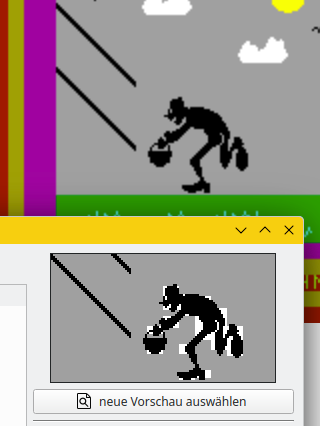
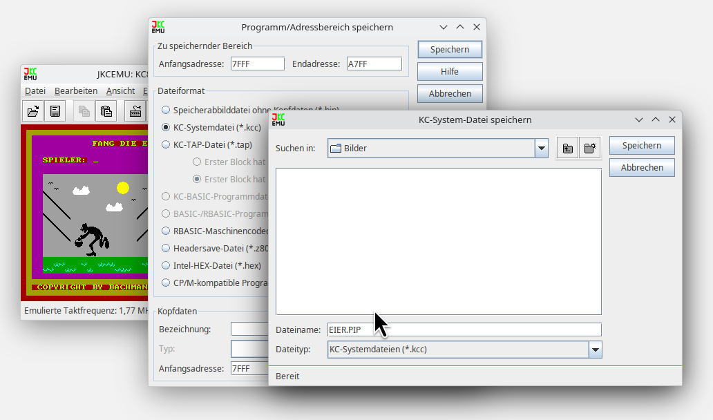
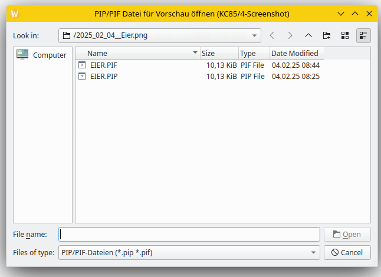

# Probleme beim Erstellen von Vorschaubildern (Icons)

Es gibt Fälle, bei denen die EPROM-Generator-Software beim Erzeugen der Vorschaubilder unerwünschte Artefakte erzeugt:

Dies tritt bei der Verwendung von Screenshots im PNG-Format auf.
Dort muß die Funktion pixmap_to_bws [1] für  jeweils acht nebeneinanderliegende RGB24-Bildpunkte das passende KC85-Farbbyte finden.
Das klappt offensichtlich nicht immer.

Um trotzdem zu schönen Vorschaubilder zu kommen, gibt es einige Workarounds:

## PICGEN.COM

Damit kann der Inhalt des jeweils nicht angezeigten Bildes als PIP-/PIF-Datei abspeichern werden. Das Programm [2] läuft unter MicroDOS bzw. CP/M und benötigt ein D004 bzw. D008.

## PICGEN.KCC

Das Tool gibt es auch in einer Variante [3] die direkt auf dem Grundgerät D001 läuft.

## JKCEMU
Im JKCEMU [4], dem umfrangreichsten KC-Emulator läst sich die Speicherfunktion nutzen, um PIP- bzw. PIF-Dateien zu erstellen.

Als Dateiformat wird KCC gewählt, der Speicherbereich geht von 7FFFh bis A7FFh und als Dateiendung wählt man PIP.

Der Bildspeicher startet zwar bei 8000h, aber das PIP-Format hat noch ein Kennbyte, welches direkt vor den Daten kommt. Richtigerweise müßte man das für eine unkomprimierte PIP-Datei auf 5 setzen.

Dann schaltet man mit ESC-9 auf die Farbebene um. Anschließend wird wieder gespeichert:
Das Dateiformat ist wieder KCC, der Speicherbereich geht wieder von 7FFFh bis A7FFh und als Dateiendung wählt man nun PIF.
Die Umschaltung auf die Farbebene klappt aber nur, wenn gerade ein Eingabefeld aktiv ist (CAOS-UP KBD oder KBDS).
Für unkomprimierte PIF-Dateien wäre das richtige Kennbyte die 4.

Anschließend lassen sich die PIP- und die PIF-Datei in der EPROM-Generator-Software auswählen:

Ggf. falsche Kennbytes werden ignoriert, aber die PIP- bzw. PIF-Dateien müssen unkomprimiert vorliegen.

# Links

[1] https://github.com/boert/KC85__M037_segmented_ROM/blob/main/EPROM-Generator/kc85color.cpp#L72

[2] http://www.kc85.info/index.php/download.html?view=download&id=192:picgen20&catid=6

[3] http://www.kc85.info/index.php/download.html?view=download&id=262:picgen&catid=27

[4] JKCEMU, Jens Müller, http://www.jens-mueller.org/jkcemu/
