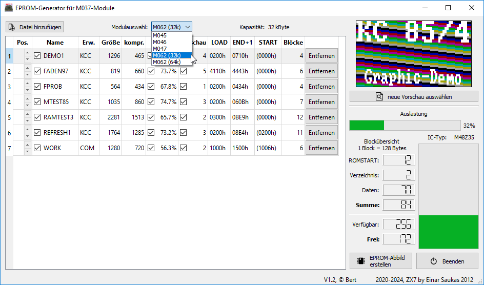

Die Software dient zum Erzeugen von EPROM-Inhalten für KC85-Module vom
Typ M045/M046/M047. Die EPROM-Software ist auf den Modellen KC85/3 und KC85/4 aus Mühlhausener Produktion, sowie den Umbauten zum KC85/5 lauffähig.

# Bedienung

Im Wesentlich besteht der Programmablauf aus vier Schritten:
1. Auswahl des Modultyps
2. Hinzufügen von KCC-Dateien
3. (optional) Auswahl der Vorschaubilder
4. Erzeugen des EPROM-Abbildes

## Start der Software

Beim Start von der Kommandozeile, können optional eine oder mehrere KCC-Dateien als Parameter mitgegeben werden.
Anschließend öffnet sich das zweigeteilte Hauptfenster. Im linken Teil befindet sich eine Liste der KC-Programme, die zum EPROM hinzugefügt werden sollen. Im rechten Teil befinden sich ein Vorschaubild, Statusinformationen und die Schaltflächen um den EPROM-Inhalt zu generieren bzw. das Programm zu beenden.
Links oben befindet sich die Schaltfläche zum Hinzufügen von Dateien, sowie die Möglichkeit den Modultyp zu ändern.

## Modultyp

Die Wahl des Modultypes wirkt sich auf den verfügbaren Speicherplatz aus.
Der ausgewählte Modultyp muß zu den verwendeten EPROMs und den Jumpereinstellungen auf der Platine passen. Die ROMSTART-Software, welche im KC ausgeführt wird, ist auf den jeweiligen Modultyp zugeschnitten.

## Programme

Momentan werden nur KCC-Dateien unterstützt. KCC-Dateien bestehen aus Blöcken zu je 128 Byte. Im ersten Block, dem Vorblock, sind Zusatzinformationen, wie der Name und die verwendeten Adressen hinterlegt (siehe auch [1]).
Diese Informationen werden in der Tabelle auf der linken Seite dargestellt, können dort aber nicht geändert werden.
Die Programmgröße wird in Bytes angegeben. Da in ROMSTART der Entpacker DZX7 [2] integriert ist, werden die Programme, bei denen es sich lohnt komprimiert im EPROM abgelegt.
Die komprimierte Größe und das Kompressionsverhältnis werden ebenfalls in der Tablle dargestellt. Die Spalte "Blöcke" enthält die Zahl der tatsächlich im EPROM benötigten 128 Byte-Blöcke.

Folgende Einstellungen können in der Tabelle vorgenommen werden:
- Ändern der Reihenfolge (dazu die Pfeile in Spalte "Pos." verwenden)
- Auswahl ob das Programm mit in den EPROM übernommen wird (Häckchen in Spalte "Name")
- Auswahl ob das Programm komprimiert wird (Häckchen in Spalte "Ratio")
- Auswahl eine Vorschau mit übernommen wird (Häckchen in Spalte "Vorschau")
- Dauerhaftes Entfernen eines Listeneintrags (letzte Spalte)

## Vorschau

Zu jedem Programmeintrag kann eine Vorschau ausgewählt bzw. angezeigt werden.
Um eine neue Vorschau zu erzeugen, wird die entsprechende Schaltfläche ausgewählt.
Es öffnet sich ein Dialog in dem ggf. die bisherige Vorschau dargestellt wird.
Im Dialog bestehen folgende Möglichkeiten:
- Öffnen einer PNG bzw. JPEG-Datei
- Öffnen einer PIC-Datei (Bildschirmauszug vom KC85/3)
- Öffnen einer PIP/PIF-Datei (Bildschirmauszug vom KC85/4)

Anschließend wird in der linken oberen Ecke ein Auswahlrechteck dargestellt, welches mit der Maus verschoben werden kann. Wenn der richtige Ausschnitt gefunden wurde, kann die Auswahl mit "Speichern" als ICN-Datei (Icon) gesichert werden.

Eine gute Möglichkeit um an passende Vorschaubilder zu erzeugen, bietet der Emulator JKCEMU [3].
Der Emulator läßt sich pausieren (Alt-P) und man kann den Bildschriminhalt als Datei sichern (Datei -> Bildschirmausgabe -> als Bilddatei speichern).
Eine nähere Erklärung für PIC/PIP/PIF-Dateien findet sich unter [4]. Im Wesentlichen sind es Bildschirmabzüge der jeweiligen KC-Systeme.
Auf dem System selbst können die Hilfsprogramme PICGEN.KCC oder PICGEN.COM verwendet werden.
Anmerkung: Um PIC/PIP/PIF-Dateien als Vorschau verwenden zu können, müssen diese unkomprimiert vorliegen.

## Statusanzeige

Unterhalb der Vorschau befindet sich eine Statusanzeige.
Dort kann man sehen, wieviel vom Gesamtspeicher schon verwendet wird (waagerechter Balken).
Die vier senkrechten Balken stehen für die einzelnen EPROM-Schaltkreise.
Falls mehr Programme ausgewählt sind, als Platz vorhanden ist, wird der Balken rot eingefärbt.
Es ist dann nicht möglich ein EPROM-Auszug zu erstellen.

Der Speicher im EPROM besteht aus drei Teilen:
1. der Verwaltungs- und Startprogramm (ROMSTART)
2. den Verzeichniseinträgen (28 Byte/Eintrag)
3. den Programmdaten
Der benötigte Platz für alle drei Teile wird unter "Summe" angezeigt.
Darunter ist die Zahl der verfügbaren Blöcke zu sehen (Modulabhängig).
Und anschließen ist unter "Frei" die Zahl der freien Blöcke abgebildet.

## Abbild erstellen

Wenn alle benötigten Programme hinzugefügt und die gewünschten Vorschaubilder erstellt sind, wird mit der Schaltfläche "EPROM-Abbild erstellen" die Datei "EPROM_M04?.bin" erstellt. Diese Datei kann sofort im Emulator getestet werden.
Zusätzlich werden die Dateien "EPROM_M04?.bin_ROM?" erstellt. Diese sind für den EPROM-Brenner gedacht.

# Quellenverweise

[1] KC85/5 System-Handbuch CAOS 4.6 bis 4.8, 3.8.2 Dateiaufbau

[2] ZX7, Einar Saukas, https://worldofspectrum.org/infoseekid.cgi?id=0027996

[3] JKCEMU, Jens Müller, http://www.jens-mueller.org/jkcemu/

[4] KC-Bildformate intern, Ralf Kästner, KC-News 2/95, http://kc85.info/index.php/kc-news/265-kc-news-2-1995.html?start=13

# Nachtrag 02/2020

Bei der Nutzung mit einem Modul M052 (USB) kommt es zu Problemen wenn am M052 die Tastatur genutzt werden soll und das ROM-Modul im Schacht 08 steckt.
In diesem Fall verdeckt ein aktiviertes ROM-Modul die Interruptroutinen im ROM des M052.
Workaround: Das ROM-Modul muß auf einem höheren Steckplatz als das M052 Modul betrieben werden. Um dennoch in den Genuß von Autostart zu kommen, läßt sich auf dem verwendeten USB-Stick eine Datei INITIAL.UUU anlegen, welche z.B. folgende Kommandos enthält:
SWITCH C C1
ROMSTART

# Nachtrag 02/2025

Falls es zu Artefakten bei der Erstellung von Vorschaubildern kommen sollte, gibt es hier weitere [Hinweise]: ICONS.md
