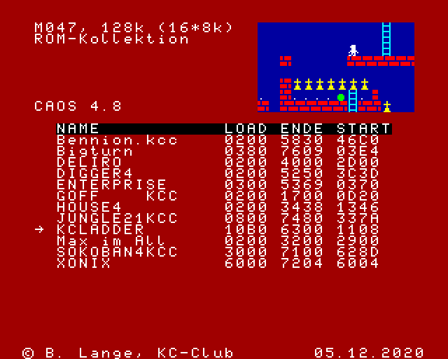
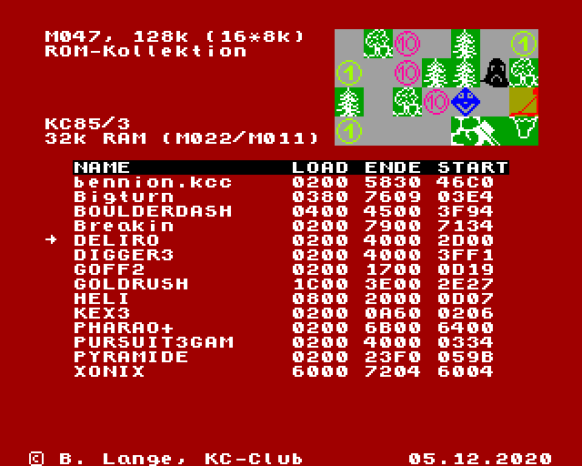
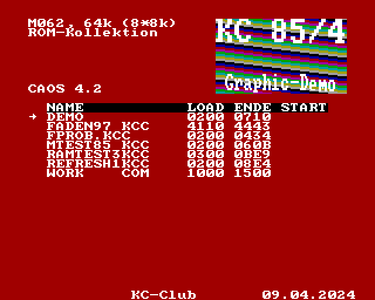

# EPROM-Inhalte

## M033__TYPESTAR

* Typestar 90 und RAMDOS V2.0

Hier gibt es weitere Informationen zu Typestar: http://www.mpm-kc85.de/html/m033_typestar.htm

## M047__12_Spiele_KC855

diese Spiele laufen alle auf dem KC85/4 mit CAOS 4.2 bis CAOS 4.8

ROMSTART vom 5.12.2020

* Bennion.kcc
* Bigturn
* DELIRO
* DIGGER4
* ENTERPRISE
* GOFF
* HOUSE4
* JUNGLE21
* KCLADDER
* MAXIMALL
* SOKOBAN4
* XONIX

## M047__14_Spiele_KC853

diese Spiele sind für den KC85/3 gedacht

ROMSTART vom 5.12.2020

* Bennion.kcc
* Bigturn
* BOULDERDASH
* Breakin
* DELIRO
* DIGGER3
* GOFF2
* GOLDRUSH
* HELI
* KEX3
* PHARAO+
* PURSUIT3
* PYRAMIDE
* XONIX

## M062__7_Tools_KC854

Ein paar kleine Demos und Tools für den KC85/4 bzw. /5

ROMSTART vom 9.4.2024

* DEMO
* FADEN97
* FPROB (Farben probieren)
* MTEST85 (Speichertest)
* RAMTEST3 (Speichertest)
* REFRESH1 (Refreshtest für M036)
* WORK (Hex-Editor)

## Copyright

Das Copyright der Software liegt beim jeweiligen Autor!
