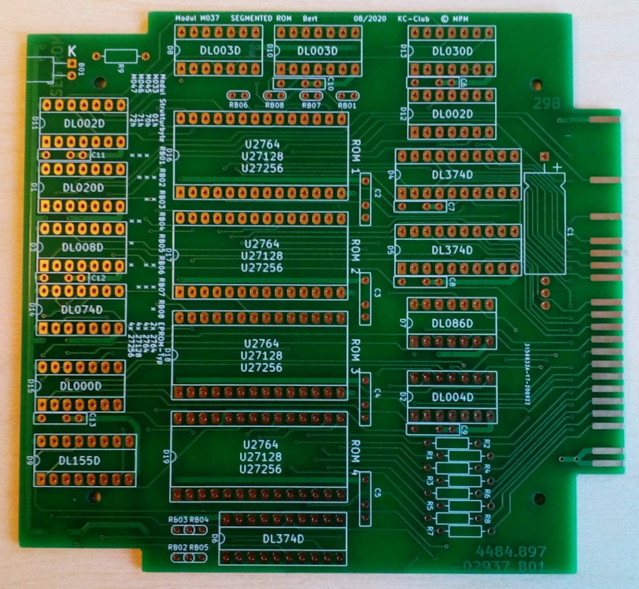

# Unterlagen zur Leiterplatte

Dokument            | Verweis
--------            | -------
Schaltplan          | [M037_Schaltplan.pdf](https://raw.githubusercontent.com/boert/KC85__M037_segmented_ROM/main/Platine/M037_Schaltplan.pdf)
Layout              | [M037_Platine.pdf](https://raw.githubusercontent.com/boert/KC85__M037_segmented_ROM/main/Platine/M037_Platine.pdf)
Stückliste/BOM      | [M037_Stueckliste.xls](https://raw.githubusercontent.com/boert/KC85__M037_segmented_ROM/main/Platine/M037_Stueckliste.xls)
Bestückungshilfe    | [M037_Bestueckhilfe.html](https://raw.githubusercontent.com/boert/KC85__M037_segmented_ROM/main/Platine/M037_Bestueckhilfe.html)

