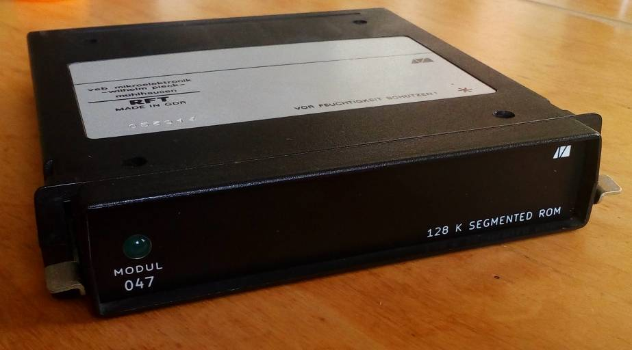
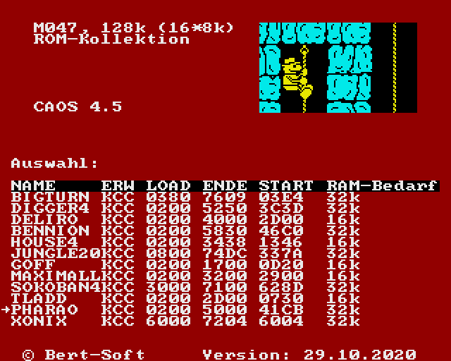

# KC85__M037_segmented_ROM
Modul für den KC85/3/4/5: Segmentierter ROM in den Größen 32/64/128 kByte

optionale Bedienoberfläche

## Verzeichnisübersicht

Verzeichnis             | Inhalt
-----------             | ------
Platine                 | Schaltplan, Layout und Stückliste/BOM
EPROM-Images            | vorgefertigt, für Emulator und EPROM-Brenner
Generator-Software      | um eigene EPROM-Images zu erstellen (C++, Qt5)
ROMSTART                | Menüsoftware, die auf dem Modul läuft (Z80-Assembler)

## Credits

Dieses Projekt nutzt u.a. folgende Software:
- KiCad, https://www.kicad.org/
- pasmo, https://pasmo.speccy.org/
- Python, https://www.python.org/
- Qt, https://www.qt.io/
- ZX7, https://spectrumcomputing.co.uk/entry/27996/ZX-Spectrum/ZX7
